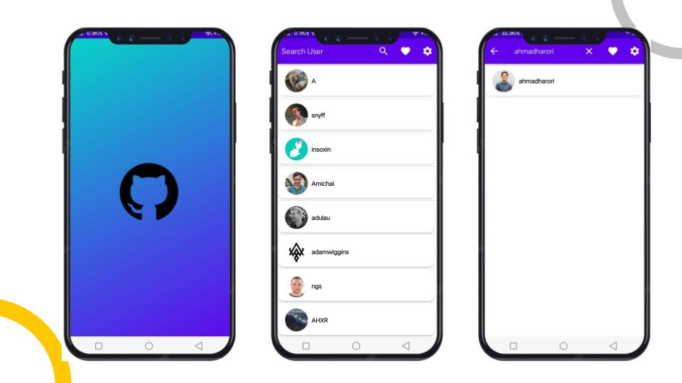
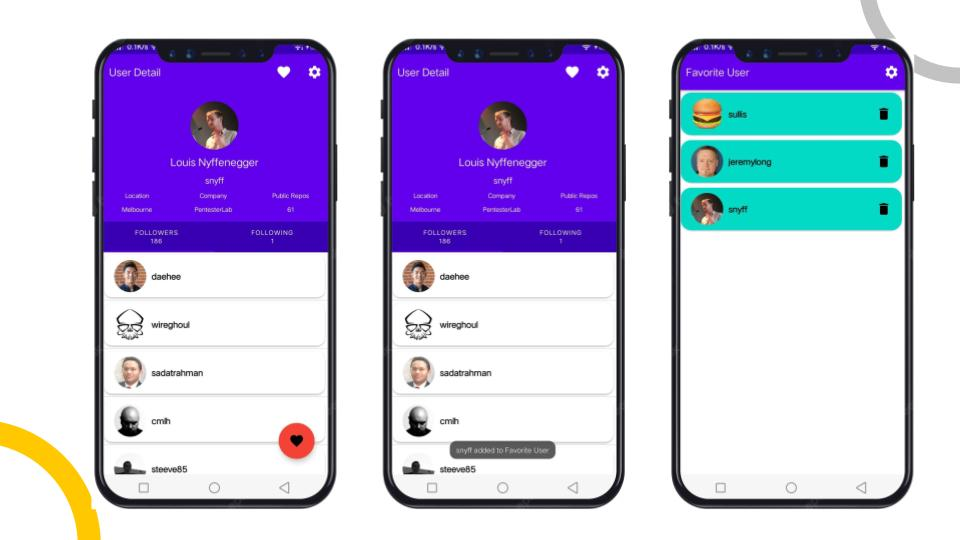
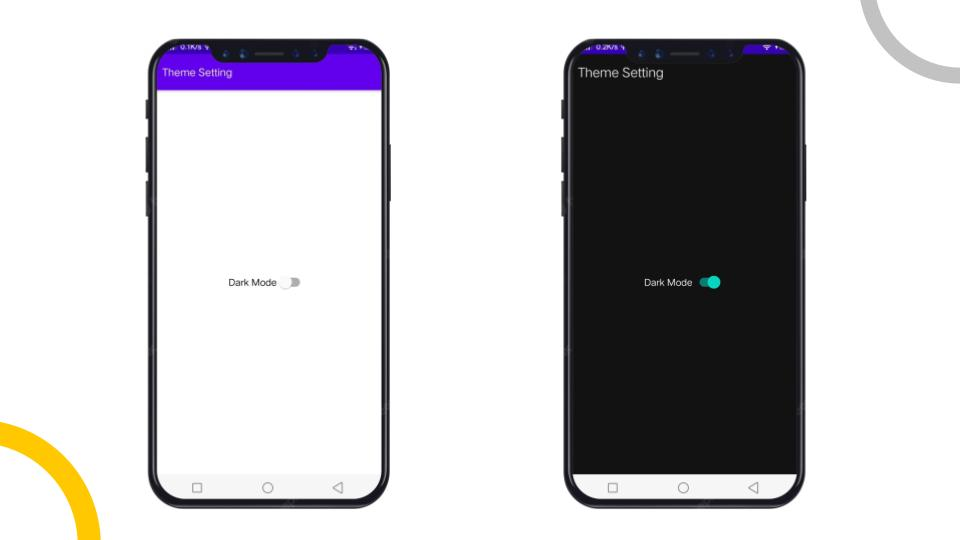

# Github User Android Application

## Preview

## List of Features
1. Splash Screen
2. Github User List
3. Search user by username
4. User Detail
5. Favorite User List
6. Dark Mode

## Dependencies and Tools
1. Kotlin Extensions (Core, ViewModel, LiveData)
2. Glide
3. Material Design
4. Constraint Layout
5. Retrofit
6. Kotlin Coroutines
7. RecylcerView, CardView
8. Datastore, preferences
9. Room
10. GSON
